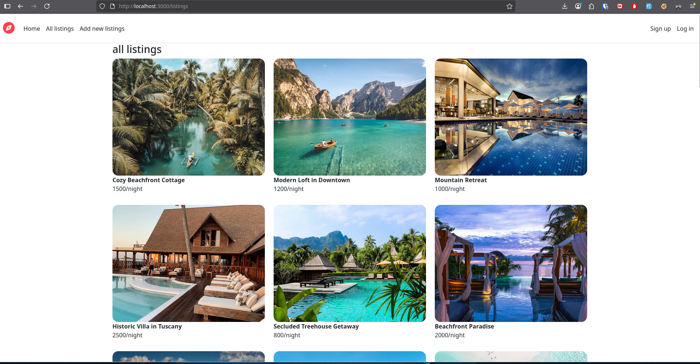

# 🏡 Airbnb Clone

A full-stack Airbnb-like web application where users can list properties.  
Built with a modern tech stack to mimic the core features of Airbnb while keeping a clean, responsive UI.

---

## ✨ Features

- 🏠 **List properties** with images, descriptions, and pricing  
- 👤 **User authentication** (sign up, login, logout)  
- 📱 **Responsive design** for mobile, tablet, and desktop  

---

## 🛠 Tech Stack

**Frontend:** HTML/ CSS / JS 
**Backend:** Node.js / Express / MongoDB  
**Authentication:** JWT 

---

## 📸 Screenshot

  

---

## 🚀 Installation

```bash
# Clone the repository
git clone https://github.com/coderakr/Airbnb.git 

# Go into the project folder
cd Airbnb

# Install dependencies
npm install

# Run the development server
npm run dev

